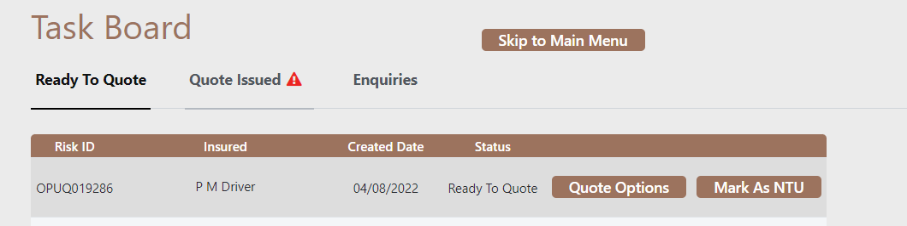
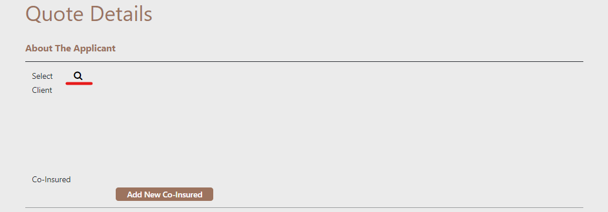
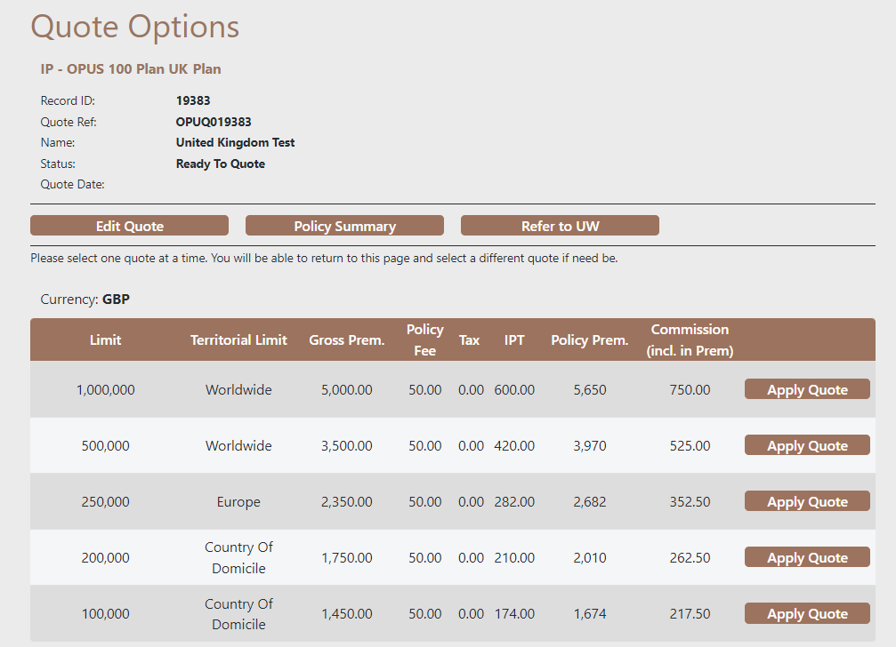

# Quickstart Guide

On logging into the system you will be presented with the Task Board.
This will display all of the issued quotes, quote options and Enquiries. 

# Add a Client

To produce a quote, first, a client must be added. Click on the Add client taskbar item at the top.

Here you will have to fill in a form with all of the client's details. It is important to make sure these details are correct, otherwise incorrect details could
invalidate a quote.

#### Key Fields to note

**Risk Class** 

Individual - A natural person or a partnership consisting of two or three persons not all of whom are bodies corporate or an unincorporated body of persons which does not consist entirely of bodies corporate and is not a partnership.

Micro Enterprise - Up to 12 employees and/or less than 1.5m GBP in annual revenues.

Commercial - 12 or more employees and/or more than 1.5m GBP in annual revenues

**Common Renewal**

Has the client requested the beginning of their policy period coincide with the renewal date of any other insurance policy(ies) they currently hold? If this is the case, please provide the date in question.

Once the details are filled out correctly, hit save; if all the fields have been satisfied, 
you may move on to generating a quote.

# Adding a Quote

Navigate to the quote page by clicking the Add Quote button at the top of the screen.

At the top of the form, you can select the client from a list of clients previously inputted into the system; you should see the client you have just added here.

Once the client has been selected, many fields will be auto-populated. Please fill in the ones that have not been.

Please input the revenue by region as a percentage breakdown on the next page 
**Please make sure that the percentages add up to 100% for both sections**

After entering a valid revenue split and answering the questions on the next page, you will be brought to the quote options.

Five different quote options now give you additional limits; you can select which option best suits your client.
Upon clicking apply quote, the quotation documents will be sent to your email address set up with your account.

# Binding a quote

If your client wishes to proceed with the quote, you must sign and upload the statement of fact document to your email.
Once this is done and a Cover period has been inputted, you may purchase the policy.

Upon clicking the purchase, you will be sent your Policy Documents and a premium closing requesting the premium payment.

**You are now at risk**