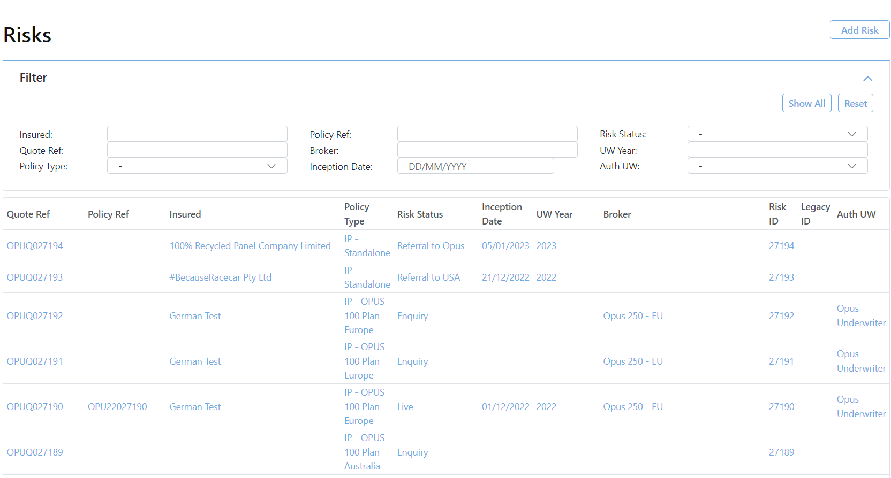

import Image from 'next/image'
 
## On load

We can show off images like this

we can do ~~strikethough~~

or do Task Lists
- [x] Write the press release
- [ ] Update the website
- [ ] Contact the media

And Tables 
| Syntax        | Description |   Test Text |
| :------------ | :---------: | ----------: |
| Header        |    Title    | Here's this |
| Paragraph     |    Text     |    And more |
| Strikethrough |             |    ~~Text~~ |

or embed youtube videos

<iframe width="560" height="315" src="https://www.youtube.com/embed/0gx3hMMDOZI" title="YouTube video player" frameborder="0" allow="accelerometer; autoplay; clipboard-write; encrypted-media; gyroscope; picture-in-picture; web-share" allowfullscreen></iframe>